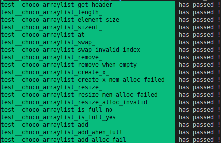

## Choco

This project provides an implementation of popular datastructures for C projects. For the moment, this library only has an arraylist implemented and fully tested.

### Tests

Tests where written with the gt library (https://github.com/gael12334/gt). As shown in the image below, the implemented arraylist is fully tested and functionnal.

### Arraylist (dynamic array)

| Functions                                                                                                              | Description                                              |
| ---------------------------------------------------------------------------------------------------------------------- | -------------------------------------------------------- |
| `_choco_arraylist_allocator _choco_arraylist_heap_allocator(void);`                                                    | Gives have allocator with libc functions (malloc & free) |
| `_choco_arraylist _choco_arraylist_create_x(_choco_arraylist_allocator allocator, unsigned size, unsigned allocated);` | Creates an arraylist with provided allocator             |
| `_choco_arraylist_header* _choco_arraylist_get_header(_choco_arraylist arrlist);`                                      | Should not be used                                       |
| `unsigned _choco_arraylist_sizeof(_choco_arraylist arrlist);`                                                          | Physical size taken by the arraylist                     |
| `unsigned _choco_arraylist_length(_choco_arraylist arrlist);`                                                          | Number of element in the arraylist                       |
| `unsigned _choco_arraylist_element_size(_choco_arraylist arrlist);`                                                    | Physical size of elements stored in arraylist            |
| `void _choco_arraylist_destroy(_choco_arraylist arrlist);`                                                             | Destroy the arraylist                                    |
| `void* _choco_arraylist_at(_choco_arraylist arrlist, unsigned index);`                                                 | Gets a pointer to an element at specified index          |
| `_choco_arraylist _choco_arraylist_resize(_choco_arraylist arrlist, unsigned desired_alloc);`                          | Resizes the arraylist allocated buffer.                  |
| `_choco_arraylist _choco_arraylist_add(_choco_arraylist arrlist);`                                                     | Adds a usable element at the back of the list            |
| `void _choco_arraylist_remove(_choco_arraylist arrlist);`                                                              | Removes an element from the back of the list             |
| `void _choco_arraylist_swap(_choco_arraylist arrlist, unsigned a, unsigned b);`                                        | Swap content between values at specified indexes         |
| `int _choco_arraylist_is_full(_choco_arraylist arrlist);`                                                              | Indicates if the list is full or not                     |

